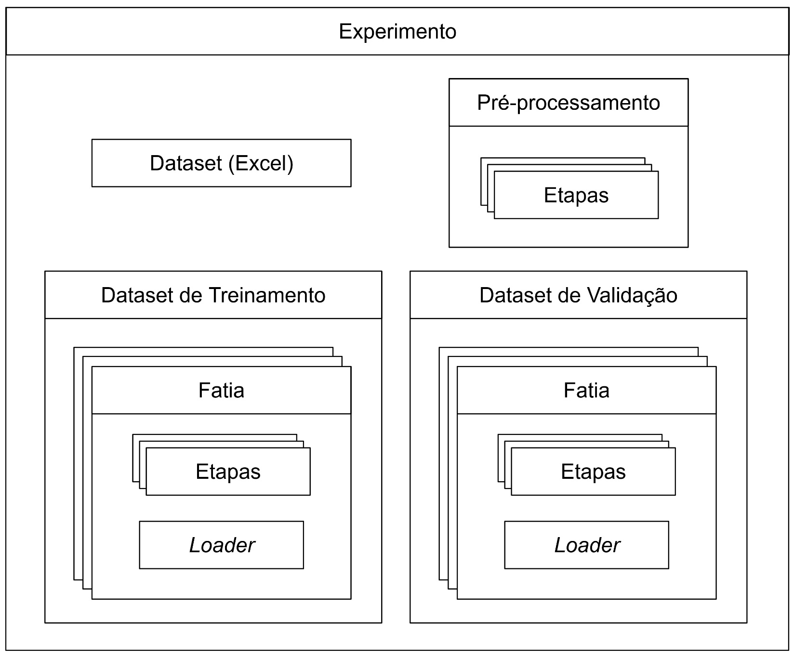

# Introdução

Durante o desenvolvimento de soluções que envolvam o treinamento de redes neurais, os pesquisadores realizam diversos experimentos até convergir em uma rede treinada que cumpra os objetivos desejados. Eles precisam definir como processar os dados de entrada e saída, qual o melhor modelo de rede neural a se utilizar e como configurar o treinamento propriamente dito. É um processo complexo, iterativo, onde a cada etapa a rede é treinada e avaliada. Os pesquisadores analisam os resultados deste treinamento para determinar quais parâmetros devem ser ajustados para o próximo experimento, repetindo esse processo sucessivamente.

Assim, não basta que o resultado de cada um desses experimentos seja uma rede treinada, os pesquisadores precisam sistematicamente analisar diversos aspectos do processo de treinamento e da performance da rede obtida. Ou seja, o processo de treinamento precisa gerar também um conjunto de relatórios e gráficos de apoio, essenciais para que o pesquisador possa continuar o processo iterativo de refinamento da rede.

Neste contexto, o número de variáveis envolvidas na definição de um experimento pode ser bem grande, assim como o número total de experimentos realizados durante o trabalho. É essencial que o pesquisador organize seus experimentos para que não haja nem perda de dados nem de resultados, e que seja sempre possível rastrear e reproduzir os experimentos realizados.

# Objetivos

O principal objetivo do framework exp é apoiar o processo iterativo de desenvolvimento de redes neurais através da estruturação dos experimentos em duas partes: sua descrição em Python, e seu respectivo relatório de treinamento.

O framework permite que o pesquisador descreva, de maneira sucinta e extensível, as etapas de processamento de dados e os parâmetros do modelo da rede neural e de seu treinamento. Através desta descrição, o framework realiza o treinamento da rede neural e gera seu respectivo relatório.

O objetivo secundário do framework é facilitar que diversos experimentos sejam realizados simultaneamente, garantindo que os resultados dos experimentos não sejam sobrescritos e que os mesmos sejam facilmente reproduzíveis.

Finalmente, o foco atual do framework é apoiar o treinamento de [redes neurais convolucionais para classificação de imagens](https://www.ibm.com/br-pt/topics/convolutional-neural-networks).

# Requisitos

A fim de alcançar os objetivos definidos acima e considerando-se o contexto da prática de desenvolvimento de redes neurais, o framework foi desenvolvido observando-se os seguintes requisitos funcionais e não funcionais.

## Requisitos Funcionais

**[RF1]** O framework deve permitir a descrição de todas as etapas de pré-processamento de dados do experimento.

**[RF2]** O framework deve permitir que o pesquisador defina qual rede neural será treinada, bem como os parâmetros pertinentes ao processo de treinamento.

**[RF3]** O framework deve suportar que o treinamento seja realizado utilizando-se técnicas de *data augmentation*, isso é, transformações nos dados realizadas a fim de aumentar a quantidade de dados disponíveis.

**[RF4]** Guiado pela descrição do experimento, o framework deve realizar as etapas de pré-processamento de dados e o treinamento da rede neural.

**[RF5]** Ao término de cada experimento, o framework deve gerar um relatório legível contendo tudo o que foi realizado, como todas as etapas de pré-processamento, as caracterísicas da rede, a evolução do treinamento e seus resultados.

## Requisitos Não-Funcionais

**[RNF1]** O framework deve ser escrito em Python 3.

**[RNF2]** Durante as etapas de pré-processamento, os dados tabulares deverão ser manipulados utilizando a biblioteca [pandas](https://pandas.pydata.org/). O mesmo se aplica às classes escritas pelos usuários.

**[RNF3]** As imagens deverão ser manipuladas utilizando matrizes [numpy](https://numpy.org). 

**[RNF4]** O framework deve ser extensível, para permitir que o desenvolvedor o adapte às especificidades de seu projeto.

**[RNF5]** O framework deve permitir que diversos experimentos sejam especificados e executados simultaneamente, compartilhando um mesmo repositório de versionamento.

**[RNF6]** Os experimentos criados utilizando o framework devem ser reproduzíveis, isso é, deve ser possível repetir um experimento futuramente mesmo que este contenha etapas aleatórias.

# Visão Geral de Uso

Ao se utilizar o framework, cada experimento é representado por uma instância da classe `Experiment`. Essa classe é o cerne do framework, pois permite configurar todos os aspectos do experimento e executá-lo. Por questões de organização, sugerimos que cada experimento seja  definido em um arquivo fonte Python separado. 

A execução do experimento é feita através do  método `Experiment.run`. Durante a execução do experimento, o framework calcula o *hash* do experimento, isso é, o *hash* de todos os parâmetros e configurações realizadas no objeto `Experiment`. 

O cálculo do *hash* é possível pois todas as classes do framework derivam da classe abstrata `Base`, dotada dos seguintes métodos:

- `add_hash`: agrega o *hash* desta instância à uma instância da classe `Hasher`.
- `__str__`: retorna uma *string* contendo a chamada ao construtor da classe que gerou esta instância.
- `description`: retorna uma descrição textual do que esta instância faz.

Isso permite ao framework não só calcular o *hash* de todas as configurações do experimento, mas também gerar um relatório textual contendo uma descrição legível do que foi feito em cada etapa do experimento, bem como o código necessário para recriar essas etapas.

Após a execução do experimento, esse relatório é criado no seguinte diretório (configurável), juntamente com os resultados do experimento:
```
 reports/[NOME DO FONTE PYTHON]_[HASH DO EXPERIMENTO]/
```

Como o nome do relatório remete ao fonte do experimento, e como o relatório contém todas as configurações do experimento, é fácil relacionar qual fonte gerou qual experimento, mesmo se o fonte for alterado posteriormente. Entretanto, não recomendamos que um arquivo de experimento seja alterado após sua execução. Para a próxima iteração do desenvolvimento, recomendamos que o experimento seja duplicado e então alterado.

Esse esquema permite que um ou mais pesquisadores criem e executem seus experimentos simultaneamente, gravando todos os experimentos e seus respectivos relatórios em um mesmo sistema de versionamento, sem que haja a preocupação de que os resultados de um experimento sejam perdidos, sobrescritos, ou necessitem de uma operação de *merge* no sistema de versionamento.

## Descrição de um Experimento

Em linhas gerais, um experimento é composto pelos seguintes itens, todos definidos pelo usuário:

1. Um arquivo Excel de *dataset*, onde cada linha representa um *sample* de dados para treinamento.
1. Uma sequência de etapas de pré-processamento global a ser aplicada em todo do *dataset*.
1. Um subconjunto do *dataset* para treinamento.
1. Um subconjunto do *dataset* para validação.
1. Um modelo básico de rede neural a ser treinada.

Para definir o arquivo Excel de entrada, o usuário do framework só precisa fornecer o nome do arquivo em disco. Isso é feito através do atributo `Experiment.input`. Neste instante, as colunas desta tabela são arbitrárias.

Para definir a sequência de etapas de pré-processamento global, o usuário deve fornecer uma lista de instâncias de classes derivadas da classe `Step` através do atributo `Experiment.preprocessing_steps`. Cada instância deve realizar uma alteração simples à tabela (como renomear uma coluna, trocar valores, selecionar linhas, etc), e elas serão aplicadas sucessivamente ao dataset carregado, na ordem em que aparecem na lista. 

Em Python:

```python
def _process_steps(dataset: pandas.DataFrame, steps: List[Step]) -> pandas.DataFrame:
    for step in steps:
        dataset = step.process(dataset)

    return dataset
```

O pré-processamento global irá gerar um *dataset* pré-processado, que será utilizado na geração dos subconjuntos de treinamento e validação. Tanto o *dataset* de treinamento quanto de validação são formados por diversas "fatias". Cada fatia é composta por uma sequência de etapas de pré-processamento (novamente uma lista instâncias de classes derivadas de `Step`) associadas a um *loader*. *Loaders* são classes derivadas da classe `BaseLoader` e encarregadas de ler uma imagem do disco aplicando uma transformação nela. 


Essas fatias são definidas pelo usuário através de sucessivas chamadas aos métodos `Experiment.add_train_set` e `Experiment.add_validation_set`, com as assinaturas abaixo:

```python
    def add_train_set(steps: List[Step], *loaders: BaseLoader) -> None:
        pass

    def add_validation_set(steps: List[Step], *loaders: BaseLoader) -> None:
        pass
``` 

Observe que vários *loaders* podem ser passados em cada chamada. Isso é equivalente à chamar o método uma vez para cada *loader*, passando a mesma lista de etapas de pré-processamento. Podemos visualizar esta configuração graficamente abaixo:



Quando um treinamento é executado, as etapas de pré-processamento globais são aplicadas ao *dataset* inicial, gerando o *dataset* pré-processado. Os *datasets* de treinamento e validação são gerados concatenando-se o resultado do processamento de cada uma de suas fatias, que consiste simplesmente em aplicar as respectivas etapas de processamento ao *dataset* pré-processado e anexar uma coluna contendo o respectivo loader.

A geração do *dataset* de treinamento pode ser simplificadamente entendida pelo seguinte código Python:

```python
# Carrega o dataset do disco
dataset = pandas.read_excel(self.input)

# Aplica as etapas de pré-processamento globais
ds_pre = _process_steps(dataset, self.preprocessing_steps)

# Inicia com um dataset de treinamento vazio
training_set = []

# Para cada "fatia" do dataset de treinamento:
for steps, loaders in training_slices:
    for loader in loaders:
        # Aplica as etapas de pré-processamento da fatia no dataset pré-processado
        slice_set = _process_steps(ds_pre, steps) 

        # Adiciona uma coluna com o loader
        slice_set.loc[:, 'loader'] = loader

        # Concatena o resultado desta fatia ao dataset de treinamento
        training_set.append (slice_set)
```

O mesmo processo é realizado para gerar o *dataset* de validação. Finalmente, para iniciar o treinamento, os datasets de treinamento e validação precisam são transformados em tabelas consolidadas, com formato padronizado, contendo apenas três colunas: 

- `input`: contém o nome do arquivo de imagem;
- `loader`: contém o *loader* a ser utilizado para carregar a referida imagem;
- `label`: contém o *label*, ou classe a que esta imagem pertence.

Como visto acima, a coluna `loader` é adicionada automaticamente. Já as colunas `input` e `label` precisam estar presentes nos *datasets* de treinamento e validação após a realização de todo o pré-processamento. Os nomes destas colunas não precisam ser necessariamente `input` e `label`: seus nomes podem ser especificados, respectivamente, através dos atributos `Experiment.image_column` e `Experiment.label_column`. As demais colunas do *dataset* são descartadas.

O treinamento é realizado utilizando esse formato padronizado de dados para alimentar a rede neural, cujo modelo a ser treinado deve ser uma instância de classe derivada de `BaseModel`, informado através do atributo `Experiment.model`.

## Regime de Treinamento

Por padrão, o treinamento de redes neurais é feito efetuando-se diversas *epochs*. Em cada *epoch*, todas as imagens no *dataset* de treinamento são fornecidas à rede, aperfeiçoando seu aprendizado. Em seguida, a performance da rede é avaliada no *dataset* de validação.

A fim de respeitar os limites de memória do computador, o *dataset* de treinamento é organizado em *batches* com um número fixo, menor de imagens. Assim, cada *epoch* é dividida em etapas, e em cada etapa um *batch* é processado.

No início de cada *epoch* também é comum se embaralhar o *dataset* de treinamento, a fim de evitar vícios oriundos da organização original dos dados. No framework, a classe `DatasetGenerator` é responsável por padrão em organizar o *dataset* de treinamento em batches de 16 imagens e por embaralhá-lo no início de cada *epoch*.

É possível configurar esse comportamento criando-se manualmente uma instância desta classe e atribuindo em  `Experiment.train_set_generator`. Outros comportamentos mais elaborados podem ser obtidos escrevendo uma nova classe derivada de `BaseDatasetGenerator`. Por exemplo, a classe `StratifiedDatasetGenerator` implementa a estratégia de [*stratified batching*](https://www.baeldung.com/cs/ml-stratified-sampling), muito utilizada para treinamentos em *datasets* desbalanceados.

## Composição do Relatório

O relatório de cada experimento é formado pelos seguintes arquivos:

- modelsummary.txt

  É a parte textual do relatório. Contém: o nome do arquivo de *dataset*; o diretório onde as imagens estão gravadas; as etapas de pré-processamento global; as etapas de pré-processamento e os *loaders* dos *datasets* de treinanento e validação; a descrição completa do modelo de rede neural utilizada; as configurações do treinamento; a performance da rede treinada em classificar os elementos nos *datasets* de treinamento e validação.

- preprocessed.xlsx

  Tabela obtida ao se aplicar as etapas de pré-processamento global ao *dataset* original.

- preprocessed_histogram.png

  Gráfico contendo quantos elementos de cada classe estão contidos no *dataset* pré-processado.

- training_set.xlsx

  Tabela contendo o *dataset* de treinamento, no formato de três colunas: `input`, `loader`, `label`.

- training_set_histogram.png

  Histograma mostrando quantos elementos de cada classe estão contidos no *dataset* de treinamento, subdivididos pelo *loader* utilizado.

- validation_set.xlsx

  Tabela contendo o *dataset* de validação, no formato de três colunas: `input`, `loader`, `label`.

- validation_set_histogram.png

  Histograma mostrando quantos elementos de cada classe estão contidos no *dataset* de validação, subdivididos pelo *loader* utilizado.

- history.png

  Gráfico mostrando a evolução ao longo do treinamento: da função de perda no *dataset* de treinamento (*training loss*), da função de perda no *dataset* de validação (*validation loss*) e a acurácia da rede ao classificar o *dataset* de validação.

- history.csv

  Tabela contendo os dados do gráfico acima.

- best.h5

  A melhor rede neural obtida durante o treinamento, isso é, aquela que obteve o menor valor para a função de perda no *dataset* de validação.

- training_set_best_confusion.png

  Gráfico mostrando a [matriz de confusão](https://pt.wikipedia.org/wiki/Matriz_de_confus%C3%A3o) da melhor rede obtida, classificando o *dataset* de treinamento.

- validation_set_best_confusion.png

  Gráfico mostrando a [matriz de confusão](https://pt.wikipedia.org/wiki/Matriz_de_confus%C3%A3o) da melhor rede obtida, classificando o *dataset* de validação.

- final.h5

  A última rede neural obtida durante o treinamento, não necessariamente a melhor.

- training_set_final_confusion.png

  Gráfico mostrando a [matriz de confusão](https://pt.wikipedia.org/wiki/Matriz_de_confus%C3%A3o) da última rede obtida, classificando o *dataset* de treinamento.

- validation_set_final_confusion.png

  Gráfico mostrando a [matriz de confusão](https://pt.wikipedia.org/wiki/Matriz_de_confus%C3%A3o) da última rede obtida, classificando o *dataset* de validação.

Um exemplo de relatório pode ser visto em em [/src/examples/training/reports/]().

# Cenários de Uso

Abaixo listamos alguns cenários de utilização onde entendemos que o uso do framework exp é apropriado, e outros cenários onde seu uso não é recomendado.

## Cenários Adequados

### Treinamento com datasets desbalanceados

*Datasets* desbalanceados são aqueles que contém um número muito diferente de elementos nas diferentes classes. Por exemplo, um pesquisador pode estar treinando uma rede para distinguir entre motos e bicicletas, possuindo 1000 fotos de motos, mas apenas 50 fotos de bicicletas. Este é um cenário desafiador, mas bastante comum na academia.

Duas características do framework o tornam adequado para o treinamento de redes neurais utilizando-se *datasets* desbalanceados:

1. A possibilidade de se adicionar a mesma imagem diversas vezes ao *dataset* de treinamento utilizando  diferentes *loaders* permite que diversas técnicas de *data augmentation* sejam aplicadas facilmente ao experimento. 

1. O `StratifiedDatasetGenerator` implementa a técnica de [*stratified batching*](https://www.baeldung.com/cs/ml-stratified-sampling), também indicada para o treinamento de redes com *datasets* desbalanceados.

### Realização de diversos experimentos simultaneamente

Se uma equipe de pesquisadores trabalhar criando e rodando experimentos de maneira não destrutiva (isso é, sem sobrescrever experimentos), os relatórios de todos os experimentos podem ser gravados em um mesmo repositório de versionamento de dados sem que esses sejam sobrescritos ou que aconteça conflitos de versão, preservando o histórico completo de experimentos e seus resultados.

## Cenários Não-Adequados

### Treinamento de redes geradoras de imagens

O framework, apesar de configurável, não é flexível o suficiente para treinar uma rede que não seja para classificação. Seria necessário alterar como a saída esperada da rede é derivada/carregada de cada elemento de ambos os *datasets*. Hoje em dia isso é feito de maneira fixa, sem possibilidade de extensão.

Talvez seja possível abusar do conceito de *encoding* dos *labels*, substituindo a classe `OneHot`, mas esse cenário não é suportado, e geraria outros inconvenientes durate a geração dos relatórios.

### Cenário Não-Adequado: Utilizar outras fontes de dados

Hoje o framework espera receber os *datasets* em forma tabular, e que as imagens estejam disponíveis para carga no sistema de arquivos, outras fontes de dados não são suportadas. Seria fácil refatorar a classe `Experiment` para que ela receba uma tabela `pandas` já carregada, ao invés do nome do arquivo Excel em disco.

Para permitir carregar imagens de outras formas que não do sistema de arquivos, seria necessário refatorar a classe `BaseLoader` e suas derivadas conforme descrito em [melhorias](docs/melhorias.md).

