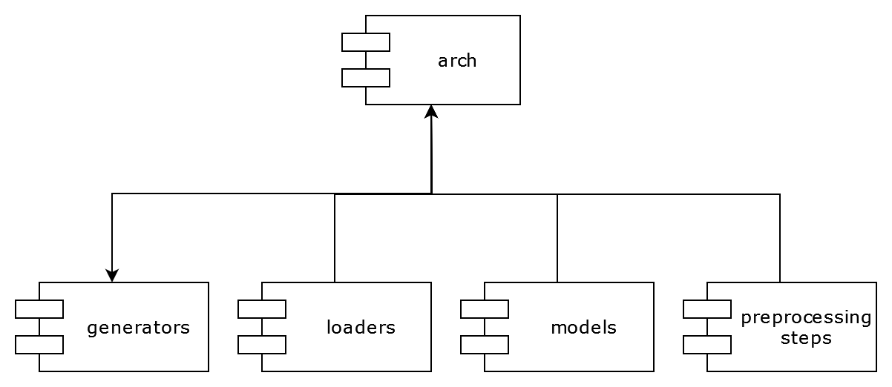
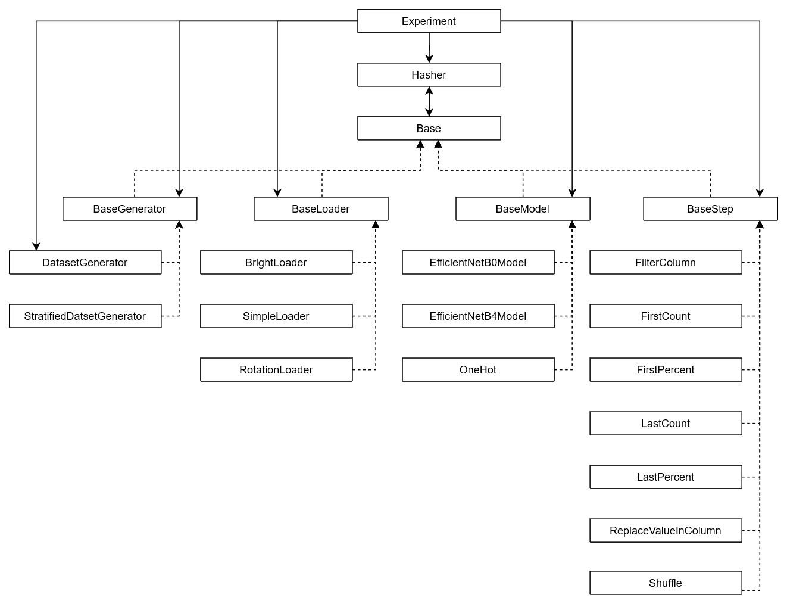

# Especificação Técnica

O framework exp é desenvolvido em Python, seguindo uma abordagem orientada a objetos. Foi feito um esforço para que todas os parâmetros de todos os métodos fossem devidamente anotados com seus respectivos tipos, gerando, assim, dependência explícita entre as classes e os módulos do framework.

Neste documento iremos descrever como o código do framework exp é organizado, seus módulos e classes, com as seguintes exceções:
- Por uma questão de brevidade, documentaremos aqui apenas as classes públicas dos módulos. 
- O diretório `src/helpers` contém arquivos auxiliares que não compõe um módulo do framework.
- O diretório `src/examples` contém os exemplos de uso do framework. Cada exemplo é documentado em seu próprio arquivo fonte e portanto omitido.

## Arquitetura

O framework é organizado em 5 módulos principais: `arch`, `generators`, `loaders`, `models` e `preprocessing_steps`, descritos a seguir:

- `arch`: é o módulo que contém as classes básicas, fundamentais do framework, isso é, as classes abstratas, prefixadas com `Base`, a classe `Hasher`, e a própria classe `Experiment`.

- `generators`: contém as classes responsáveis por gerenciar as *epochs* do treinamento, implementações de `arch.BaseDatasetGenerator`.

- `loaders`: contém as classes responsáveis por carregar as imagens do sistema de arquivos e aplicar uma transformação nelas. São as implementações de `arch.BaseLoader`.

- `models`: contém os modelos de redes neurais que podem ser treinadas pelo framework. São as implementações de `arch.BaseModel`.

- `preprocessing_steps`: contém as etapas de pré-processamento do *dataset*. São as implementações de `arch.BaseStep`.

Não existem muitas dependências entre módulos pois cada classe possui uma responsabilidade bem definida e independente. Todos os módulos dependem do módulo `arch` pois este contém as classes abstratas implementadas nos módulos. A única exceção é a dependência do que o módulo `arch` tem do `generators`. 

Isso acontece porque a classe `generators.DatasetGenerator` é o gerenciador de *epoch* padrão do framework, e precisa ser instanciado automaticamente quanto um gerador não é informado. Essa situação pode ser claramente visualizada no diagrama de classes abaixo:

## Referência de Classes

### Arch

#### Base

##### `__str__()`

##### `description() -> str`

##### `add_hash(hasher)`

#### DatasetGenerator

#### Experiment

#### Hasher

#### Preprocessing

#### Step

---

### Models

#### EfficientNetB0Model

#### EfficientNetB4Model

#### OneHot

---

### Loaders

#### BaseLoader

#### BrightLoader

#### RotationLoader

---

### Preprocessing Steps

#### ChangeColumn

#### FilterColumn

#### FirstCount

#### FirstPercent

#### LastCount

#### LastPercent

#### Shuffle